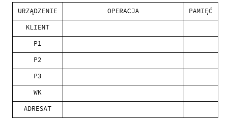

# The cake router
**UWAGA** Polecamy zapoznać się z HTMLową wersję niniejszej
specyfikacji dostępnej w repozytorium Github
[link](https://github.com/jacawaca/the-cake-router) .

## Trasowanie cebulowe
Trasowanie cebulowe jest techniką służącą do anonimowej komunikacji w sieci
komputerowej. Komunikacja odbywa się przy wykorzystaniu trzech rodzajów
jednostek: klienci, węzły pośredniczące i końcowe.
Połączenie klienta z odbiorcą wygląda następująco.
W pierwszej kolejności klient wybiera listę węzłów P1,P2,…,PN,WK
po których chce dotrzeć do adresata.
Następnie nadaje paczkę informacji {dane,adres[P2-ADRESAT]} do 
P1. Dalej P1 zapisuje adres klienta i wysyła paczkę
{dane,adres[P3-ADRESAT]} do P2. Proces się powtarza aż węzeł końcowy - WK - wyślę pakiet do adresata.



Droga w kierunku przeciwnym jest następująca: adresat wysyła
odpowiedź do WK. Z kolei z WK jest wysyłana ta odpowiedź do PN,
do WK zapisał adres. Dalej PN przesyła odpowiedź do PN-1 itd., aż
odpowiedź wróci do klienta.

## Funkcjonalności

Nasz program będzie spełniał następujące wymagania:
- umożliwi przesyłanie komunikatów UDP (*user datagram protocol*, protokół
bezstanowy, nie zapewnia retransmisji danych, umożliwia przesyłanie danych
do wielu użytkowników).
- ~~możliwość sprawdzenia poprawności danych przy użyciu sumy kontrolnej (np.
*sha256sum*)~~
- Klient będzie posiadał listę wszystkich węzłów pośredniczących ($P_i$ oraz WK).
- ~~Z poziomu klienta będzie możliwy wybór trasy przez N węzłów pośredniczących 
(na podstawie powyższej listy). Liczba N będzie dowolna, ale mniejsza od ilości
dostępnych węzłów pośredniczących.~~
- Komunikaty będą zawierały paczkę złożoną z informacji przesyłanych oraz
adresów
- Możliwe będzie przesłanie paczki do innego hosta (który również
«oferuje» swoje usługi jako węzeł pośredni) i otrzymanie od niego odpowiedzi.
- Sieć będzie w stanie obsłużyć równolegle przynajmniej dwóch klientów.

## Opis działania programu
Klient będzie uruchamiał program poprzez poprzez prosty alias. Na potrzeby robocze
załóżmy, że będzie to cake-router.
Zakładamy, że program będzi mógł być używany w następujący sposób
``` bash
usage: cake-router [options]
options:
-l --list                             Wyświetla listę dostępnych hostów.  
``````
~~Mogą posłużyć do wyboru węzłów pośrednich przy próbie wysłania~~
Będzie wczytywał plik config
```bash
-s --send [adress] ~~[trasa]~~ [num]
```
Wysyła komunikat na podany adres.
W przypadku gdyby adres nie został podany, użytkownik ma możliwość
wyboru adresu z listy. Ewentualnie wyświetli mu się taka lista,
na podstawie której będzie mógł wybrać adres.
~~Gdyby trasa nie została podana, to program - o ile to możliwe - 
użyje domyślnej (wczyta z pliku). Jest możliwość wyboru
ilości węzłów pośredniczących [num]. Wówczas te węzły są losowe.~~
```
--set-trasa                           Ustala domyślną trasę.
```
Program generujący plik konfiguracyjny (FUNKCJONALNOŚĆ OPCJONALNA)
```
--listen                              Nasłuchuj komunikatów.

--help                                Wyświetla ten komunikat.
```
Rozpatrujemy możliwość zadeklarowania trasy poprzez specjalny
plik ~~lub odpowiednio zadeklarowaną przy wywołaniu programu
listę.~~ lub poprzez miniprogram, który uruchomi na się przy użyciu opcji
--set-trasa.
## Obsługa programu
Klient uruchamia program cake-router w bashu poprzez wpisanie
``` bash
$ cake-router
```
Wyświetla mu się informacja o możliwych opcjach. Następnie
uruchamia program z opcją list
``` bash
$ cake-router -l
```
Dostaje informacje o ~~możliwych węzłach pośrednich (i docelowych).~~ węzłach
pośrednich z listy conf.

~~Przygotowuje trasę i wysyła komunikat np na adres lokalny 192.168.1.03 poprzez 3 węzły pośredniczące~~

Po wysłaniu użytkownik programu oczekuje na odpowiedź od nadawcy.

## TO DO
[//]: # (Aby oznaczyć pozycję w liście za zrobioną zamień [ ] na [X])
- [ ] 1. Skrypt w Shellu. Uruchomienie programu poprzez javę (coś jak 
``` sh
java -jar coś tam coś tam
```
  )
- [X] 1.1 Skrypt dla klienta
- [X] 1.2 i dla węzła (Node)
- [X] 2. Obsługa dwóch klientów na raz. Jeśli to rozumiem tak, że paczki są przesyłanej
  w tej samej chwili (a nie po sobie), to trzeba będzie pewnie coś pokombinować z tym, jak
  prevAdress jest używany. Może lista zbiorów {prevAdress, message} tak, żeby można
  Działa dla klientów mających różne IP. Inaczej port jest zablokowany. JS
  było zidentyfikować prevAdress z każdym kolejnym klientem.
- [X] 3. Posprzątać javę: adres jest trzymany w stringu. Można w InetAdress (zamienić pola) JS
- [ ] 4  W niektórych miejscach kopiowałem kod. Można by zrobić jakąś procedurę jako
  static w UPDNode. Ale nie trzeba. W sumie łączy się z 3.
- [X] 5  Niech ostatni węzeł (adresat) wyświetla otrzymaną wiadomość. JS
- [X] 6  Możliwość ręcznego wpisania odpowiedzi? Wówczas trzeba by ustawić odpowiednio
  input w UDPNode. JS
- [X] 7 W ogóle nie wiem, czy nie trzeba będzie rozdzielić przypadków, gdy i) wiadomość
  dochodzi do adresata ii) wiadomość wraca po węzłach pośredniczących? Łączy się to
  z 6. i 3., 4. i może 2.
  Udało się to połączyć w CakeClient JS
  
Poniższe rzeczy to po tym jak już zrobimy skrypt (front-end) w bashu na choćby *minimalnej
funkcjonalności*.
- [X] 8  Skrypt w Shellu: opcja list JS
- [X] 9  Skrypt w Shellu: opcja send z różnymi plikami wiadomości JS
- [X] 10 Skrypt w Shellu: opcja *set trasa* (OPCJONALNIE) JS
- [ ] 11 Skrypt w Shellu: inne opcje?
- [X] 12 Skrypt w Shellu: testowanie błędów: co gdy nie ma zainstalowanej javy itp
Napisałem, ale nwm czy działa JS

- [ ] 13
