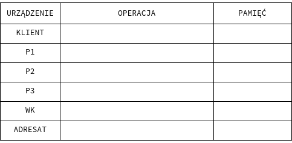

# The cake router
Trasowanie cebulowe jest techniką służącą do anonimowej komunikacji w sieci
komputerowej. Komunikacja odbywa się przy wykorzystaniu trzech rodzajów
jednostek: klienci, węzły pośredniczące i końcowe.
Połączenie klienta z odbiorcą wygląda następująco.
W pierwszej kolejności klient wybiera listę węzłów P1,P2,…,PN,WK
po których chce dotrzeć do adresata.
Następnie nadaje paczkę informacji {dane,adres[P2-ADRESAT]} do 
P1. Dalej P1 zapisuje adres klienta i wysyła paczkę
{dane,adres[P3-ADRESAT]} do P2. Proces się powtarza aż węzeł końcowy - WK - wyślę pakiet do adresata.



Droga w kierunku przeciwnym jest następująca: adresat wysyła
odpowiedź do WK. Z kolei z WK jest wysyłana ta odpowiedź do PN,
do WK zapisał adres. Dalej PN przesyła odpowiedź do PN-1 itd., aż
odpowiedź wróci do klienta.

## Funkcjonalności

Nasz program będzie spełniał następujące wymagania:
- umożliwi przesyłanie komunikatów UDP (*user datagram protocol*, protokół
bezstanowy, nie zapewnia retransmisji danych, umożliwia przesyłanie danych
do wielu użytkowników).
- możliwość sprawdzenia poprawności danych przy użyciu sumy kontrolnej (np.
*sha256sum*)
- Klient będzie posiadał listę wszystkich węzłów pośredniczących ($P_i$ oraz WK).
- Z poziomu klienta będzie możliwy wybór trasy przez N węzłów pośredniczących 
(na podstawie powyższej listy). Liczba N będzie dowolna, ale mniejsza od ilości
dostępnych węzłów pośredniczących.
- Komunikaty będą zawierały paczkę złożoną z informacji przesyłanych oraz
adresów
- Możliwe będzie przesłanie paczki do innego hosta (który również
«oferuje» swoje usługi jako węzeł pośredni) i otrzymanie od niego odpowiedzi.
- Sieć będzie w stanie obsłużyć równolegle przynajmniej dwóch klientów.

## Opis działania programu
Klient będzie uruchamiał program poprzez poprzez prosty alias. Na potrzeby robocze
załóżmy, że będzie to cake-router.
Zakładamy, że program będzi mógł być używany w następujący sposób
``` bash
usage: cake-router [options]
options:
-l --list   Wyświetla listę dostępnych hostów.
    -s --send   
```

